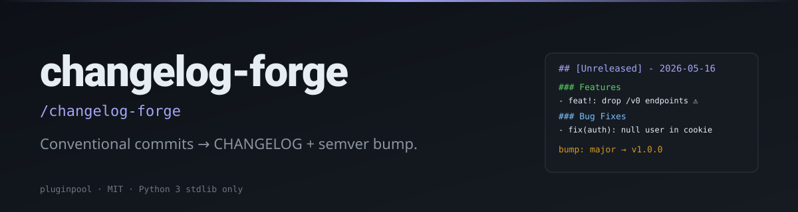

# changelog-forge

**Turn your conventional commits into a real CHANGELOG entry. Plus a semver bump suggestion.**

[](./LICENSE)
[](https://www.python.org/)
[](https://docs.claude.com/en/docs/claude-code/overview)
[](./tests)

> **TL;DR:** `/changelog-forge` → grouped CHANGELOG section + suggested `major | minor | patch`, derived from your commit history since the last tag.

#### Writing

**LinkedIn**
- 🗡️ [Çift Yüzlü Katana: Yapay Zeka Dönüşümlerinin Gerçekçi Bir Analizi](https://www.linkedin.com/pulse/%C3%A7ift-y%C3%BCzl%C3%BC-katana-yapay-zeka-d%C3%B6n%C3%BC%C5%9F%C3%BCmlerinin-ger%C3%A7ek%C3%A7i-bir-mehmet-turac-80h7f) — AI transformations realistic analysis. The 5 illusions that compound into expensive, fragile systems.
- 📄 [LinkedIn Articles](https://www.linkedin.com/in/mehmetturac/recent-activity/articles/) — All published articles
- 📊 [LinkedIn Documents](https://www.linkedin.com/in/mehmetturac/recent-activity/documents/) — Research papers and technical documents

**Dev.to**
- [Why AI Agents Fail?](https://dev.to/turacthethinker/why-ai-agents-fail-ddg)
- [We Ship to Production Without Tests. Here's How It Destroyed Us.](https://dev.to/turacthethinker/we-ship-to-production-without-tests-heres-how-it-destroyed-us-i4i)
- [I built a product in one AI session. Here's the system that made it ship right.](https://dev.to/turacthethinker/i-built-a-product-in-one-ai-session-heres-the-system-that-made-it-ship-right-3mb3)
- [Remote Work Didn't Break Productivity — It Broke Human Connection](https://dev.to/turacthethinker/remote-work-didnt-break-productivity-it-broke-human-connection-288o)
- [Hermes vs OpenClaw: Which AI assistant would you actually trust?](https://dev.to/turacthethinker/hermes-vs-openclaw-which-ai-assistant-would-you-actually-trust-bbl)
- [Strategic LLM Adoption: A Director's Guide to Fine-Tuning Models](https://dev.to/turacthethinker/strategic-llm-adoption-a-directors-guide-to-fine-tuning-models-for-domain-specific-applications-4e37)
- [The Context Window Lie: Why Your LLM Remembers Nothing](https://dev.to/turacthethinker/the-context-window-lie-why-your-llm-remembers-nothing-5h1p)
- [Stop Your AI Agent From Building Tools That Already Exist](https://dev.to/turacthethinker/stop-your-ai-agent-from-building-tools-that-already-exist-6o9)
- [Why Versioned SQL Beats Vector RAG for Agent Memory Systems](https://dev.to/turacthethinker/why-versioned-sql-beats-vector-rag-for-agent-memory-systems-1jo3)
- [I Got Access to 136 AI Models for Free — NVIDIA NIM API Deep Dive](https://dev.to/turacthethinker/i-got-access-to-136-ai-models-for-free-nvidia-nim-api-deep-dive-111o)
- [Your Agent Isn't Reflecting. It's Performing Reflection.](https://dev.to/turacthethinker/your-agent-isnt-reflecting-its-performing-reflection-b41)
- [How I Stopped My AI Agent From Reinventing the Wheel](https://dev.to/turacthethinker/how-i-stopped-my-ai-agent-from-reinventing-the-wheel-24eo)


#### Writing

- ✍️ [**Dev.to · TuracTheThinker**](https://dev.to/turacthethinker) — Technical articles on AI, agentic systems, and production engineering
- 📄 [**LinkedIn Articles**](https://www.linkedin.com/in/mehmetturac/recent-activity/articles/) — Industry insights and analysis
- 📊 [**LinkedIn Documents**](https://www.linkedin.com/in/mehmetturac/recent-activity/documents/) — Research papers and technical documents

- 🗡️ [**Çift Yüzlü Katana: Yapay Zeka Dönüşümlerinin Gerçekçi Bir Analizi**](https://www.linkedin.com/pulse/%C3%A7ift-y%C3%BCzl%C3%BC-katana-yapay-zeka-d%C3%B6n%C3%BC%C5%9F%C3%BCmlerinin-ger%C3%A7ek%C3%A7i-bir-mehmet-turac-80h7f) — AI transformations realistic analysis. The 5 illusions that compound into expensive, fragile systems. (LinkedIn, 2026)


## Install (Claude Code)

```sh
git clone https://github.com/mturac/pluginpool-changelog-forge ~/.claude/plugins/changelog-forge
```

Restart Claude Code; the slash command `/changelog-forge` appears.

#### Writing

- ✍️ [**Dev.to · TuracTheThinker**](https://dev.to/turacthethinker) — Technical articles on AI, agentic systems, and production engineering
- 📄 [**LinkedIn Articles**](https://www.linkedin.com/in/mehmetturac/recent-activity/articles/) — Industry insights and analysis
- 📊 [**LinkedIn Documents**](https://www.linkedin.com/in/mehmetturac/recent-activity/documents/) — Research papers and technical documents

- 🗡️ [**Çift Yüzlü Katana: Yapay Zeka Dönüşümlerinin Gerçekçi Bir Analizi**](https://www.linkedin.com/pulse/%C3%A7ift-y%C3%BCzl%C3%BC-katana-yapay-zeka-d%C3%B6n%C3%BC%C5%9F%C3%BCmlerinin-ger%C3%A7ek%C3%A7i-bir-mehmet-turac-80h7f) — AI transformations realistic analysis. The 5 illusions that compound into expensive, fragile systems. (LinkedIn, 2026)


## Quick start

```sh
/changelog-forge
```

Or directly:

```sh
python3 scripts/forge.py --format md
python3 scripts/forge.py --from v1.2.0 --to HEAD --format json
python3 scripts/forge.py --write                  # prepend (idempotently) to CHANGELOG.md
```

#### Writing

- ✍️ [**Dev.to · TuracTheThinker**](https://dev.to/turacthethinker) — Technical articles on AI, agentic systems, and production engineering
- 📄 [**LinkedIn Articles**](https://www.linkedin.com/in/mehmetturac/recent-activity/articles/) — Industry insights and analysis
- 📊 [**LinkedIn Documents**](https://www.linkedin.com/in/mehmetturac/recent-activity/documents/) — Research papers and technical documents

- 🗡️ [**Çift Yüzlü Katana: Yapay Zeka Dönüşümlerinin Gerçekçi Bir Analizi**](https://www.linkedin.com/pulse/%C3%A7ift-y%C3%BCzl%C3%BC-katana-yapay-zeka-d%C3%B6n%C3%BC%C5%9F%C3%BCmlerinin-ger%C3%A7ek%C3%A7i-bir-mehmet-turac-80h7f) — AI transformations realistic analysis. The 5 illusions that compound into expensive, fragile systems. (LinkedIn, 2026)


## Flags

| Flag | Default | Description |
|---|---|---|
| `--cwd` | cwd | Repo path |
| `--from` | last tag | Base ref/tag |
| `--to` | `HEAD` | End ref |
| `--format` | `md` | `md` or `json` |
| `--write` | off | Prepend (idempotently) to `CHANGELOG.md`; correctly inserts AFTER any leading `# Changelog` title |
| `--changelog` | `CHANGELOG.md` | Target file |

#### Writing

- ✍️ [**Dev.to · TuracTheThinker**](https://dev.to/turacthethinker) — Technical articles on AI, agentic systems, and production engineering
- 📄 [**LinkedIn Articles**](https://www.linkedin.com/in/mehmetturac/recent-activity/articles/) — Industry insights and analysis
- 📊 [**LinkedIn Documents**](https://www.linkedin.com/in/mehmetturac/recent-activity/documents/) — Research papers and technical documents

- 🗡️ [**Çift Yüzlü Katana: Yapay Zeka Dönüşümlerinin Gerçekçi Bir Analizi**](https://www.linkedin.com/pulse/%C3%A7ift-y%C3%BCzl%C3%BC-katana-yapay-zeka-d%C3%B6n%C3%BC%C5%9F%C3%BCmlerinin-ger%C3%A7ek%C3%A7i-bir-mehmet-turac-80h7f) — AI transformations realistic analysis. The 5 illusions that compound into expensive, fragile systems. (LinkedIn, 2026)


## Conventional-commit reference

Headers parsed as `<type>(<scope>)!: <subject>`. Recognised types:

`feat`, `fix`, `perf`, `refactor`, `docs`, `test`, `build`, `ci`, `chore`, `revert`.

Anything else falls into an `other` bucket.

Breaking changes are detected when:

- the header has `!` before `:` (e.g. `feat!: drop /v0`), or
- the body contains `BREAKING CHANGE: …`.

#### Writing

- ✍️ [**Dev.to · TuracTheThinker**](https://dev.to/turacthethinker) — Technical articles on AI, agentic systems, and production engineering
- 📄 [**LinkedIn Articles**](https://www.linkedin.com/in/mehmetturac/recent-activity/articles/) — Industry insights and analysis
- 📊 [**LinkedIn Documents**](https://www.linkedin.com/in/mehmetturac/recent-activity/documents/) — Research papers and technical documents

- 🗡️ [**Çift Yüzlü Katana: Yapay Zeka Dönüşümlerinin Gerçekçi Bir Analizi**](https://www.linkedin.com/pulse/%C3%A7ift-y%C3%BCzl%C3%BC-katana-yapay-zeka-d%C3%B6n%C3%BC%C5%9F%C3%BCmlerinin-ger%C3%A7ek%C3%A7i-bir-mehmet-turac-80h7f) — AI transformations realistic analysis. The 5 illusions that compound into expensive, fragile systems. (LinkedIn, 2026)


## Semver bump heuristic

| Trigger | Bump |
|---|---|
| any breaking | `major` |
| any `feat` | `minor` |
| any `fix` / `perf` | `patch` |
| everything else | `patch` (effectively a no-op) |

When a base tag is present (e.g. `v0.4.2`), the JSON output also returns `suggested_version`.

#### Writing

- ✍️ [**Dev.to · TuracTheThinker**](https://dev.to/turacthethinker) — Technical articles on AI, agentic systems, and production engineering
- 📄 [**LinkedIn Articles**](https://www.linkedin.com/in/mehmetturac/recent-activity/articles/) — Industry insights and analysis
- 📊 [**LinkedIn Documents**](https://www.linkedin.com/in/mehmetturac/recent-activity/documents/) — Research papers and technical documents

- 🗡️ [**Çift Yüzlü Katana: Yapay Zeka Dönüşümlerinin Gerçekçi Bir Analizi**](https://www.linkedin.com/pulse/%C3%A7ift-y%C3%BCzl%C3%BC-katana-yapay-zeka-d%C3%B6n%C3%BC%C5%9F%C3%BCmlerinin-ger%C3%A7ek%C3%A7i-bir-mehmet-turac-80h7f) — AI transformations realistic analysis. The 5 illusions that compound into expensive, fragile systems. (LinkedIn, 2026)


## Example output (markdown)

```
#### Writing

- ✍️ [**Dev.to · TuracTheThinker**](https://dev.to/turacthethinker) — Technical articles on AI, agentic systems, and production engineering
- 📄 [**LinkedIn Articles**](https://www.linkedin.com/in/mehmetturac/recent-activity/articles/) — Industry insights and analysis
- 📊 [**LinkedIn Documents**](https://www.linkedin.com/in/mehmetturac/recent-activity/documents/) — Research papers and technical documents

- 🗡️ [**Çift Yüzlü Katana: Yapay Zeka Dönüşümlerinin Gerçekçi Bir Analizi**](https://www.linkedin.com/pulse/%C3%A7ift-y%C3%BCzl%C3%BC-katana-yapay-zeka-d%C3%B6n%C3%BC%C5%9F%C3%BCmlerinin-ger%C3%A7ek%C3%A7i-bir-mehmet-turac-80h7f) — AI transformations realistic analysis. The 5 illusions that compound into expensive, fragile systems. (LinkedIn, 2026)


## [Unreleased] - 2026-05-16

### Features
- **api**: paginate search endpoint (a1b2c3d)

### Bug Fixes
- handle null user in cookie middleware (e4f5g6h)

### Performance
- cache token-bucket counters (12ab34c)

_Suggested bump: **minor**_
_Suggested version: **0.5.0**_
```

#### Writing

- ✍️ [**Dev.to · TuracTheThinker**](https://dev.to/turacthethinker) — Technical articles on AI, agentic systems, and production engineering
- 📄 [**LinkedIn Articles**](https://www.linkedin.com/in/mehmetturac/recent-activity/articles/) — Industry insights and analysis
- 📊 [**LinkedIn Documents**](https://www.linkedin.com/in/mehmetturac/recent-activity/documents/) — Research papers and technical documents

- 🗡️ [**Çift Yüzlü Katana: Yapay Zeka Dönüşümlerinin Gerçekçi Bir Analizi**](https://www.linkedin.com/pulse/%C3%A7ift-y%C3%BCzl%C3%BC-katana-yapay-zeka-d%C3%B6n%C3%BC%C5%9F%C3%BCmlerinin-ger%C3%A7ek%C3%A7i-bir-mehmet-turac-80h7f) — AI transformations realistic analysis. The 5 illusions that compound into expensive, fragile systems. (LinkedIn, 2026)


## Idempotency

Running `--write` twice with the same input produces the same file — both the diff and the SHA are stable. There's a dedicated test (`test_write_changelog_idempotent`) that runs the writer twice and asserts byte-for-byte equality.

#### Writing

- ✍️ [**Dev.to · TuracTheThinker**](https://dev.to/turacthethinker) — Technical articles on AI, agentic systems, and production engineering
- 📄 [**LinkedIn Articles**](https://www.linkedin.com/in/mehmetturac/recent-activity/articles/) — Industry insights and analysis
- 📊 [**LinkedIn Documents**](https://www.linkedin.com/in/mehmetturac/recent-activity/documents/) — Research papers and technical documents

- 🗡️ [**Çift Yüzlü Katana: Yapay Zeka Dönüşümlerinin Gerçekçi Bir Analizi**](https://www.linkedin.com/pulse/%C3%A7ift-y%C3%BCzl%C3%BC-katana-yapay-zeka-d%C3%B6n%C3%BC%C5%9F%C3%BCmlerinin-ger%C3%A7ek%C3%A7i-bir-mehmet-turac-80h7f) — AI transformations realistic analysis. The 5 illusions that compound into expensive, fragile systems. (LinkedIn, 2026)


## Limitations

- Flat conventional-commit grammar — multi-paragraph footers (`Refs:` blocks etc.) aren't merged.
- `--write` only manages the `## [Unreleased]` block. Promoting it to a versioned section at release time is a manual step.

#### Writing

- ✍️ [**Dev.to · TuracTheThinker**](https://dev.to/turacthethinker) — Technical articles on AI, agentic systems, and production engineering
- 📄 [**LinkedIn Articles**](https://www.linkedin.com/in/mehmetturac/recent-activity/articles/) — Industry insights and analysis
- 📊 [**LinkedIn Documents**](https://www.linkedin.com/in/mehmetturac/recent-activity/documents/) — Research papers and technical documents

- 🗡️ [**Çift Yüzlü Katana: Yapay Zeka Dönüşümlerinin Gerçekçi Bir Analizi**](https://www.linkedin.com/pulse/%C3%A7ift-y%C3%BCzl%C3%BC-katana-yapay-zeka-d%C3%B6n%C3%BC%C5%9F%C3%BCmlerinin-ger%C3%A7ek%C3%A7i-bir-mehmet-turac-80h7f) — AI transformations realistic analysis. The 5 illusions that compound into expensive, fragile systems. (LinkedIn, 2026)


## Examples

Step-by-step walkthroughs with real input fixtures and the helper's actual output live in [`examples/`](./examples/README.md). Three or four scenarios per plugin — from the happy path to the edge cases the test suite guards.

#### Writing

- ✍️ [**Dev.to · TuracTheThinker**](https://dev.to/turacthethinker) — Technical articles on AI, agentic systems, and production engineering
- 📄 [**LinkedIn Articles**](https://www.linkedin.com/in/mehmetturac/recent-activity/articles/) — Industry insights and analysis
- 📊 [**LinkedIn Documents**](https://www.linkedin.com/in/mehmetturac/recent-activity/documents/) — Research papers and technical documents

- 🗡️ [**Çift Yüzlü Katana: Yapay Zeka Dönüşümlerinin Gerçekçi Bir Analizi**](https://www.linkedin.com/pulse/%C3%A7ift-y%C3%BCzl%C3%BC-katana-yapay-zeka-d%C3%B6n%C3%BC%C5%9F%C3%BCmlerinin-ger%C3%A7ek%C3%A7i-bir-mehmet-turac-80h7f) — AI transformations realistic analysis. The 5 illusions that compound into expensive, fragile systems. (LinkedIn, 2026)


## Part of the pluginpool family

Ten focused Claude Code plugins for everyday productivity:
[commit-narrator](https://github.com/mturac/pluginpool-commit-narrator) ·
[pr-storyteller](https://github.com/mturac/pluginpool-pr-storyteller) ·
[test-gap](https://github.com/mturac/pluginpool-test-gap) ·
[deps-doctor](https://github.com/mturac/pluginpool-deps-doctor) ·
[env-lint](https://github.com/mturac/pluginpool-env-lint) ·
[secret-guard](https://github.com/mturac/pluginpool-secret-guard) ·
[standup-gen](https://github.com/mturac/pluginpool-standup-gen) ·
[todo-harvest](https://github.com/mturac/pluginpool-todo-harvest) ·
[flaky-detector](https://github.com/mturac/pluginpool-flaky-detector) ·
[changelog-forge](https://github.com/mturac/pluginpool-changelog-forge)

#### Writing

- ✍️ [**Dev.to · TuracTheThinker**](https://dev.to/turacthethinker) — Technical articles on AI, agentic systems, and production engineering
- 📄 [**LinkedIn Articles**](https://www.linkedin.com/in/mehmetturac/recent-activity/articles/) — Industry insights and analysis
- 📊 [**LinkedIn Documents**](https://www.linkedin.com/in/mehmetturac/recent-activity/documents/) — Research papers and technical documents

- 🗡️ [**Çift Yüzlü Katana: Yapay Zeka Dönüşümlerinin Gerçekçi Bir Analizi**](https://www.linkedin.com/pulse/%C3%A7ift-y%C3%BCzl%C3%BC-katana-yapay-zeka-d%C3%B6n%C3%BC%C5%9F%C3%BCmlerinin-ger%C3%A7ek%C3%A7i-bir-mehmet-turac-80h7f) — AI transformations realistic analysis. The 5 illusions that compound into expensive, fragile systems. (LinkedIn, 2026)


## License

MIT — see [`LICENSE`](./LICENSE). Contributions welcome.
